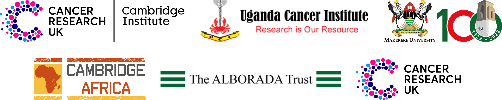

# Cambridge Makerere Summer School
## Essential preparations prior to attending Bioinformatics workshop
### Ashley Sawle
### 21st October 2024

There will be two practical bioinformatics workshops delivered at the 2024 Summer School:

* **Introduction to R**  - Monday - Wednesday pm

* **Differential Gene Expression Analysis of Bulk RNAseq data with DESeq2 in R** - Thursday - Friday pm

## **Essential Actions before the start of the Summer School** 

**Please attend to this as soon as possible in order to give yourself time should you encounter any problems**

For both workshops you will need to bring a laptop with all the necessary
software and data files for the workshop. 

Before attending the workshops you must:

1. [Install **R** and **RStudio**](Precourse_Instructions.html#installing-r-and-rstudio)
2. [Install the `tidyverse` R package (necessary for both workshops)](Precourse_Instructions.html#installing-the-tidyverse-r-package)
2. [Install the necessary R packages for the RNAseq workshop, if you are attending](Precourse_Instructions.html#installing-packages-for-the-differential-gene-expression-analysis-workshop)
3. [Download the necessary data for the workshops](Precourse_Instructions.html#installing-packages-for-the-differential-gene-expression-analysis-workshop)

The documents linked above contain instructions for carrying out each of tasks.

If you have any difficulty installing any of the software then please contact
Peter at sabakakipeterz@gmail.com for help.

